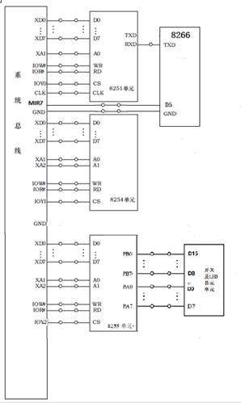

# 基于WiFi控制的LED流水灯

[toc]

本项目源于一次微机原理课程设计，自己在做的时候相关参考资料略少踩了不少坑，完成后开源课程设计供其他有需要的人参考。

## 一、题目说明分析

> 使用WiFi模块ESP8266通过串口将控制信号（WiFi模块使用B/S通过网页输入信号）传给8251，通过8255将控制信号通过LED灯显示，以实现流水灯的初值、方向、速度控制。

考虑到不同平台的用户都能使用的情况，结合单片机ESP8266的优势，设计B/S（浏览器/服务器）模式的流水灯控制网页。实现连上单片机ESP8266的热点，并访问指定网页即可进行控制。实验箱8251a接收单片机ESP8266串口控制数据，进而结合8259与8255进行流水灯控制。

## 二、软件与硬件电路

**用到的硬件**

* TD-PITE实验箱及串口线

* 8251a

* 8255

* 8259a

* 8254

* esp8266及串口线

* 杜邦线若干

**电路连接图**

**软件平台**

* esp8266使用Arduino开发
* 实验箱芯片汇编使用Wmd86

## 三、实施方案

### 1、从浏览器中输入流水灯控制信号            

本次课程设计主要利用单片机esp8266建立HTTP服务器，利用esp8266建立WiFi热点，控制设备（可为电脑、手机等）连接esp8266热点，浏览器访问HTTP控制网页进行流水灯的初始状态、流动方向、流动速度的输入。

* **初始状态**：输入的LED流水灯初始状态两位16进制数，即初始状态支持8位的设定，浏览器中使用JS脚本将16进制转换为10进制。

* **流动方向**：提供选择按钮让用户选择方向，选向左则方向标记为0（选右标记为1）。

* **流动速度**：共10级，0级为不流动，1级最慢、10级最快。通过拖拽滑动条实现速度调节。

按下控制网页中的开始按键向esp8266的HTTP服务器提交控制信息接着进行串口发送，若串口发送成功后则HTTP服务器返回已发送串口控制数据，浏览器弹出设定数据值和已发送的提示。

### 2、单片机串口发送控制信号至实验箱8251a

由于流水灯在运行期间是一个死循环，这个时候如果单片机esp8266串口发送新的控制信号，8251a无法接收，这会导致串口发送数据丢失。所以单片机esp8266在发送前先请求中断（单片机esp8266的GPIO口连接实验箱MIR7，通过GPIO口输出低电平再输出高电平产生一个上升沿的正脉冲），8259配置好中断相关程序，转入8251a的程序查询串口输入。这样每次单片机往实验箱用串口发送数据时，先进行中断请求，实验箱转入等待串口输入状态，以保证串口发送数据不丢失且响应成功。

**串口传输的帧格式为波特率9600bps，8位数据位，一位停止位，偶校验。**

* **串口发送方**（单片机**esp8266**）：单片机esp8266从HTTP服务器获得控制信号（状态初值、流向、速度，获得过程见3.1），单片机请求中断，延迟一段时间，然后将三个控制信号使用串口发送。其中每一个控制信号用一个字节存储，分别发送三个字节，发完一个延迟一段时间等待发送缓冲区空再进行下一个数据发送，不加延时串口发送可能会丢失数据。

* **串口接收方**（实验箱**8251a**）：若实验箱正在处理其它任务（比如流水灯流动），MIR7检测到中断信号，则立马转入8251a接收等待，准备接收单片机欲发送的数据。实验箱8251a进行接收等待，若检测到接收缓冲区有数据将其写入内存，因为发送方发送三个字节数据，接收一共写入内存三次使用LOOP控制。接收完数据以后转入8255控制逻辑开始使用控制信号控制流水灯。

### 3、处理控制信号以开始流水灯流动

处理上一步写入内存的三个控制信号（初值、流向、速度），使用8255进行流水灯控制。8255的A口连接实验箱上的LED灯D0到D7共8个LED，根据三个控制信号来将初值进行移位显示（左移ROL，右移ROR），速度的决定由显示LED灯值之前加入的延时个数确定，如果速度为0则只显示初值在8个LED上，然后直接跳转到等待下一次串口数据的接收。若速度取到10则加一个延迟，取到1加10个延迟，通过LOOP控制。

本次课设还用到了8255的B口，由于A口只显示8位流水灯未免显得单调，所以在B口同时输出与A口相同的LED灯控制值。不同点是B口的PB0接LED排灯的D15，PB7接LED排灯D8，此时D15~D8显示的是D7~D0的镜像反转（镜像反转的意思是指D7~D0如果向右流动、D15~D8会向左流动。D7~D0位初始状态为01H，则D15~D8初始状态为10H）。

## 四、项目构建方法

1. 硬件布线检查清楚
2. 配置好Arduino IDE使用Arduino IDE将ESP8266/main.ino编译上传至esp8266。
3. 使用Wmd86编译连接加载80x86实验箱/main.asm至实验箱
4. 连接ESP8266的无线热点"WiFi智能流水灯"
5. 用4中连接好的设备浏览器访问192.168.5.2进去后设置好初值，点击开始则可以开始流水灯流动

注：由于ESP8266在上传代码时，D5可能会出现电平跳变（产生脉冲）可能会在此时触发中断引起莫名问题，故应先上传ESP8266再加载实验箱。

